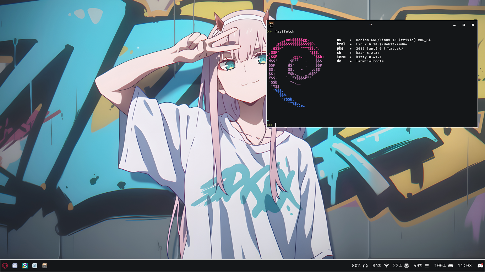

# larpwc
my personal labwc dotfiles. it's minimal and clean.




# usage:
copy the .config, .themes and Wallpapers to $HOME. you also win new wallpapers:P

# required packages:
this rice needs some packages to work:

```
labwc, waybar, (pipewire/pulseaudio), fastfetch/icefetch/hyfetch, libnotify-bin/notify-send, swaync, kitty, swaybg, rofi, slurp, grim, swappy, opera-gx 
```

and their dependecies.